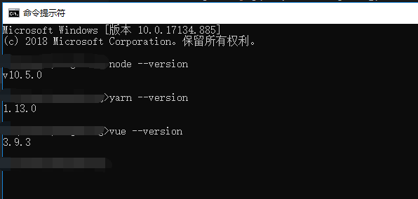
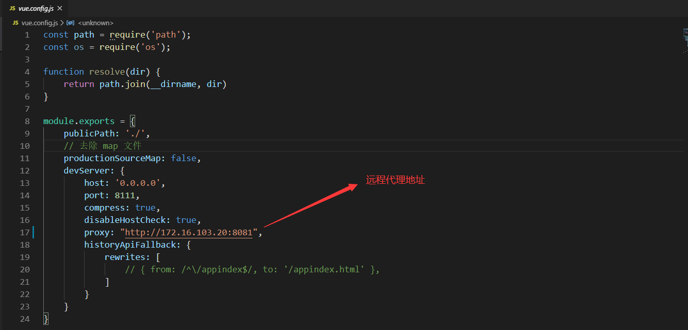

## 前言

### 1. 简介

该web应用是基于iBiz平台提供的一套PC端前端解决方案Vue_R7【**一套基于Vue全家桶（Vue + Vue-router + Vuex）的前端框架**】生产而成，Vue_R7不仅适用于管理后台或管理系统开发，且广泛适用于B/S架构的项目开发。本文档主要介绍项目如何快速上手，成果物代码结构做一阐述，旨在能够为开发人员提供一定开发指导支持。而今框架开源，希望能有更多志同道合的伙伴参与Vue_R7的迭代 ^_^

### 2. 开发环境要求

- Node.js

- Yarn

- Vue Cli

### 3. 开发技术要求

掌握`Vue`、`TypeScript`、`less`、`html`等技术。

### 4. 技术栈

- 前端MVVM框架：vue.js 2.6.10

- 路由：vue-router 3.1.3

- 状态管理：vue-router 3.1.3

- 国际化：vue-i18n 8.15.3

- 数据交互：axios 0.19.1

- UI框架：element-ui 2.13.0, view-design 4.1.0

- 工具库：qs, path-to-regexp, rxjs

- 图标库：font-awesome 4.7.0

- 引入组件： tinymce 4.8.5

- 代码风格检测：eslint


## 快速上手

### 1. 开发环境

> 在安装使用 `Yarn` 和 `Vue Cli (3.0)` 前，务必确认 [Node.js](https://nodejs.org) 已经升级到 v4.8.0 或以上，强烈建议升级至最新版本。
> 如果你想了解更多 `Yarn` 工具链的功能和命令，建议访问 [Yarn](https://yarnpkg.com) 了解更多。
> 如果你想了解更多 `Vue Cli (3.0)` 工具链的功能和命令，建议访问 [Vue Cli (3.0)](https://cli.vuejs.org/) 了解更多。

- 访问 [Node.js](https://nodejs.org) ，根据文档安装 `Node.js`。
- 访问 [Yarn](https://yarnpkg.com) ，根据文档安装 `Yarn`。
- 访问 [Vue Cli (3.0)](https://cli.vuejs.org/) ，根据文档安装 `Vue Cli (3.0)`。

<blockquote style="border-color: red;"><p>在安装 Vue Cli (3.0) ,请使用 Yarn 模式全局安装。</p></blockquote>

```bash
$ yarn global add @vue/cli
```

以下为 Windows 环境开发正常配置 
<br>
<br>


### 2. 安装依赖

打开前端项目，进入工作空间下，执行安装依赖命令

```bash
$ yarn install
```

### 3. 启动

在工作空间下，执行启动命令

```bash
$ yarn dev-serve
```

启动后，通过 vue.config.js 开发服务 devServer 下配置的本地启动端口号访问开发项目。<br>
示例: 

```bash
$ http://localhost:8111
```
这儿需要注意一点，此时启动的项目访问的数据是我们前端的mock数据，如需与后台直接交互，请看第4点。

### 4. 远程代理

在工作空间下，执行启动命令

```bash
$ yarn serve
```

修改远程代理文件 vue.config.js 代理地址



### 5. 打包

在工作空间下，执行打包命令

```bash
$ yarn build
```

打包完成，生成最终交付产物。

## 成果物结构

```
|─ ─ app_Web
​    |─ ─ public                                 public文件夹
​        |─ ─ assets                             静态文件夹
        |─ ─ favicon.ico                        图标
​    |─ ─ src                                    工程文件夹
        |─ ─ assets                             静态资源
        |─ ─ codelist                           动态代码表服务
        |─ ─ components                         基础组件，主要包含编辑器组件和其他全局使用的组件
        |─ ─ counter                            计数器服务
        |─ ─ engine                             引擎文件，主要封装了内置视图的内置逻辑
        |─ ─ environments                       环境文件
​        |─ ─ interface                          接口文件
​        |─ ─ locale                             多语言文件
        |─ ─ mock                               模拟数据
        |─ ─ pages                              视图文件夹
            |─ ─ module                         模块名称
​                |─ ─  XXX-view                  视图文件夹
                    |─ ─  XXX-view-base.vue     视图基类
                    |─ ─  XXX-view.vue          自定义视图文件
                    |─ ─  XXX-view.less         自定义视图样式文件
        ​            |─ ─  main.ts               应用主函数入口
        ​            |─ ─ page-register.ts       全局视图注册
        ​            |─ ─ router.ts              路由配置文件
        |─ ─ service                            应用实体数据服务文件夹
            |─ ─ XXX                            应用实体名称
                |─ ─ XXX-service-base.ts        应用实体数据服务文件
                |─ ─ XXX-service.ts             自定义应用实体数据服务文件
                |─ ─ YYY-logic-base.ts          应用实体数据处理逻辑文件
                |─ ─ YYY-logic.ts               自定义应用实体数据处理逻辑文件
        |─ ─ store                              全局状态管理
        |─ ─ styles                             样式文件夹
            |─ ─ default.less                   默认样式
            |─ ─ user.less                      用户自定义样式
        |─ ─ theme                              主题文件夹
        |─ ─ uiservice                          界面服务文件
            |─ ─ XXX                            应用实体名称
                |─ ─ XXX-ui-service-base.ts     应用实体界面服务文件
                |─ ─ XXX-ui-service.ts          自定义应用实体界面服务文件
                |─ ─ YYY-ui-logic-base.ts       应用实体界面处理逻辑文件
                |─ ─ YYY-ui-logic.ts            自定义应用实体界面处理逻辑文件
        |─ ─ utils                              工具类文件
        |─ ─ utilservice                        应用功能服务
        |─ ─ widgets                            部件文件夹
            |─ ─ appde                          应用实体名称
​                |─ ─  XXX                       部件名称
                    |─ ─  XXX-base.vue          视图基类
                    |─ ─  XXX.vue               自定义部件文件
                    |─ ─  XXX.less              部件样式文件
        ​            |─ ─  XXX.model.ts          部件model文件 
        ​            |─ ─  XXX.service.ts        部件服务文件
        |─ ─ app-register.ts                    公共组件全局注册
​        |─ ─ App.vue                            入口组件
​        |─ ─ user-register.ts                   自定义组件全局注册
        ​|─ ─ package.json                       依赖管理文件
​        |─ ─ vue.config.js                      vue cli 配置
```

## 如何贡献

如果你希望参与贡献，欢迎 [Pull Request](<http://demo.ibizlab.cn/ibiz_r7/vue_r7/issues/new>)，或通过自助服务群给我们报告 Bug。

强烈推荐阅读 [《提问的智慧》](https://github.com/ryanhanwu/How-To-Ask-Questions-The-Smart-Way)(本指南不提供此项目的实际支持服务！)、[《如何向开源社区提问题》](https://github.com/seajs/seajs/issues/545) 和 [《如何有效地报告 Bug》](https://www.chiark.greenend.org.uk/~sgtatham/bugs-cn.html)、[《如何向开源项目提交无法解答的问题》](https://zhuanlan.zhihu.com/p/25795393)，更好的问题更容易获得帮助。

## 社区互助

1.[iBizLab论坛](https://bbs.ibizlab.cn/)

2.加入钉钉 Vue_R7自助服务群（中文）

